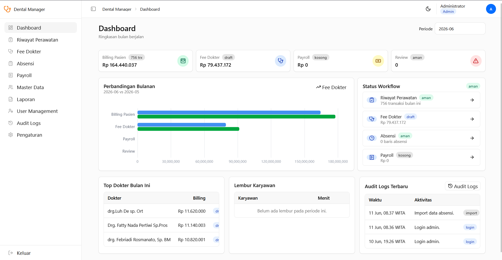
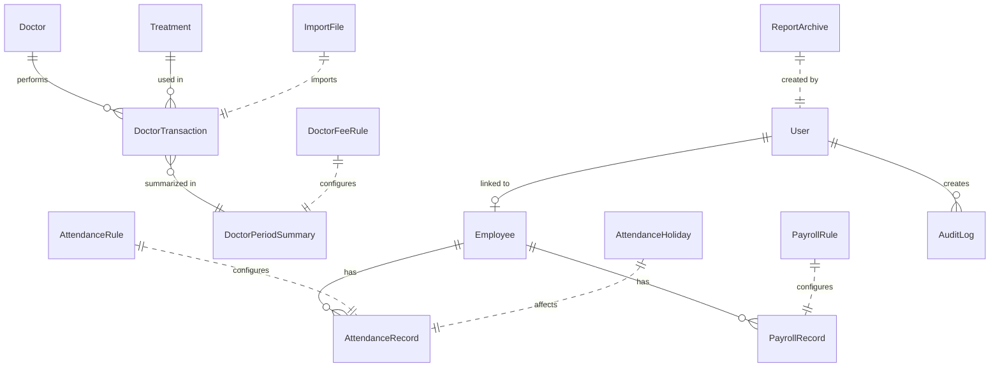

# 🦷 Dental Manager

> Aplikasi web internal untuk manajemen klinik gigi — menggantikan workflow manual Excel untuk perhitungan fee dokter, payroll karyawan, pencatatan riwayat perawatan, dan absensi.



## ✨ Fitur Utama

### 🔐 Autentikasi & Otorisasi

- Login dengan username/password dan opsi "Remember me".
- JWT token-based authentication dengan bcrypt password hashing.
- **2 role** dengan akses berbeda:
  - **Admin** — Akses penuh ke semua fitur.
  - **Operator** — Akses terbatas: Riwayat Perawatan, Absensi (view + protes), Payroll Saya (self-service), Audit Akun.

### 📊 Dashboard

- **Dashboard Admin**:
  - 4 KPI card: Billing Pasien, Fee Dokter, Payroll, Review.
  - Grafik perbandingan bulanan (current vs previous period).
  - Panel status workflow: Riwayat Perawatan, Fee Dokter, Absensi, Payroll.
  - Tabel top 3 dokter by billing & top 3 karyawan lembur.
  - 3 audit log terbaru.
- **Dashboard Operator**:
  - 4 KPI card: Riwayat Perawatan, Absensi, Payroll Saya, Audit Akun.
  - Tabel transaksi perawatan terbaru, absensi terbaru, dan audit log akun.

### 🩺 Riwayat Perawatan

- Pencatatan transaksi perawatan per periode (dokter, pasien, treatment, qty, diskon, dll).
- Mode **"Add Another"** untuk input cepat berturut-turut.
- Import dari Excel (XLSX) dengan preview & validasi sebelum commit.
- Download template XLSX.
- Filter by dokter, status review, dan tanggal.
- Operasi bulk: multi-select, hapus massal.

### 💰 Fee Dokter

- Kalkulasi otomatis fee dokter per periode berdasarkan transaksi perawatan.
- Perhitungan: fee perawatan, fee ortho/behel, potongan, pajak, nominal transfer.
- Grafik perbandingan bulanan (Billing, Total Fee, Transfer, Pajak).
- Tabel summary per dokter dengan detail transaksi (drill-down).
- Lock periode setelah semua review selesai.
- Export: XLSX recap, PDF gabungan, atau ZIP PDF per dokter.
- Banner kontekstual: status draft, perlu review, locked.

### 📋 Absensi

- Pencatatan absensi harian dengan 2 timezone (shift I & II).
- Auto-kalkulasi: terlambat, pulang awal, lembur, double shift.
- Integrasi kalender hari libur dari Pengaturan.
- Import dari Excel dengan preview & validasi.
- Download template XLSX.
- **Fitur protes (Operator)**: kirim catatan protes pada record absensi.
- Filter by karyawan, status review, status kehadiran, dan tanggal.
- Operasi bulk: multi-select, hapus massal, tandai review/OK.

### 💵 Payroll

- Kalkulasi otomatis payroll per periode berdasarkan data absensi.
- Komponen: gaji pokok, double shift, hari minggu/libur, lembur, bonus, tunjangan jabatan, BPJS, PPh21, potongan lain.
- Grafik perbandingan bulanan (Gross, Potongan, Lembur, Transfer).
- Detail lembur per karyawan (drill-down).
- Dialog adjustment per karyawan (bonus, tunjangan, potongan, cuti, bank, dll).
- Lock periode setelah semua review absensi & payroll selesai.
- Export: XLSX recap, PDF gabungan, ZIP PDF per karyawan, slip gaji PDF individu.

### 👤 Payroll Saya (Self-Service Operator)

- Lihat slip gaji sendiri per periode.
- Kartu ringkasan: total transfer, gaji pokok, lembur, bonus, tunjangan, potongan.
- Info pembayaran: bank, nomor rekening, hari kerja.
- Download slip PDF & export Excel personal.
- Tabel detail lembur individu.

### 📦 Master Data

3 entitas yang dapat dikelola (CRUD lengkap):

| Entitas       | Field Utama                                                                            |
| ------------- | -------------------------------------------------------------------------------------- |
| **Treatment** | Kode, nama, kategori, biaya dokter/spesialis, BHP, service fee, harga, catatan         |
| **Dokter**    | Nama, bank, rekening, NIK, rate fee normal/ortho, rate pajak                           |
| **Karyawan**  | Nama, ID absensi, posisi, tanggal masuk, gaji pokok, hari kerja, status training, bank |

- **Operasi**: Tambah, Edit, Aktifkan/Nonaktifkan, Hapus permanen.
- **Bulk operations**: Multi-select, bulk aktifkan/nonaktifkan/hapus.
- **Import Excel**: Upload XLSX → preview → commit.
- **Download template** XLSX per entitas.
- Filter by status (aktif/nonaktif) dan group (kategori/bank/posisi).

### 📄 Laporan & Arsip

- Browser arsip laporan yang pernah di-export.
- Tipe laporan: Fee Dokter, Payroll, Slip Gaji.
- Format: XLSX, PDF, ZIP.
- Search, filter by tipe/format/status, download, dan hapus.
- Auto-expiry: arsip disimpan 90 hari lalu dibersihkan otomatis.
- Metadata: tanggal, tipe, periode, format, status (draft/final), ukuran file, pembuat.

### 👥 User Management (Admin Only)

- CRUD user: username, nama lengkap, password, role, link ke karyawan, status aktif.
- Inline editing langsung di tabel.
- Reset password per user.

### 📝 Audit Logs

- **System-wide** (Admin): seluruh log aktivitas sistem.
- **Self-only** (Operator): log aktivitas akun sendiri.
- Kolom: timestamp (WITA), aktor, aksi (color-coded badge), tipe entitas, deskripsi, metadata.
- Filter by aksi dan tipe entitas.

### ⚙️ Pengaturan

- **Identitas Laporan**: Nama klinik untuk header PDF/XLSX.
- **Aturan Payroll**: Gaji pokok default, rate BPJS JHT, rate lembur/menit, threshold & rate PPh21, multiplier hari minggu & double shift.
- **Aturan Absensi**: Jadwal timezone I & II (jam masuk/keluar).
- **Aturan Fee Dokter**: Rate fee normal/ortho, rate pajak, potongan default.
- **Kalender Hari Libur**: Kelola hari libur per bulan dengan multi-date picker.
- **Developer Tools** (development only): Refresh database untuk reset data.

### 🌙 UI/UX

- Dark/Light mode (disimpan di localStorage).
- Sidebar collapsible (mode icon-only).
- Breadcrumbs navigasi.
- Toast notification untuk feedback operasi.
- Format mata uang Rupiah (IDR).
- Timezone WITA untuk display waktu.
- Bahasa Indonesia untuk seluruh antarmuka.
- Responsive layout (md/lg/xl breakpoints).
- Pagination & sticky column pada DataTable.

---

## 🏗️ Tech Stack

### Frontend

| Teknologi            | Versi | Kegunaan                |
| -------------------- | ----- | ----------------------- |
| React                | 19    | UI framework            |
| TypeScript           | 5.7   | Type safety             |
| Vite                 | 6     | Build tool & dev server |
| React Router DOM     | 7     | Client-side routing     |
| TanStack React Query | 5     | Server state management |
| ECharts              | 6     | Grafik & chart          |
| Cloudflare Kumo      | 2.5+  | UI component library    |
| Lucide React         | —     | Icon library            |

### Backend

| Teknologi        | Versi  | Kegunaan                    |
| ---------------- | ------ | --------------------------- |
| FastAPI          | 0.115  | Web framework               |
| Uvicorn          | 0.34   | ASGI server                 |
| SQLModel         | 0.0.22 | ORM (SQLAlchemy + Pydantic) |
| Alembic          | 1.14   | Database migrations         |
| SQLite           | —      | Database                    |
| openpyxl         | 3.1    | Excel generation/reading    |
| ReportLab        | 4.2    | PDF generation              |
| python-jose      | 3.3    | JWT token                   |
| passlib + bcrypt | —      | Password hashing            |

---

## 🚀 Cara Menjalankan

### Dengan Docker (Produksi / Homeserver)

1. Copy `.env.example` menjadi `.env` dan sesuaikan nilai-nilainya:

   ```bash
   cp .env.example .env
   ```

2. Jalankan:

   ```bash
   docker compose up --build -d
   ```

3. Buka `http://localhost:8080`.

4. Login default: `admin` / `admin12345`.

### Development (Lokal)

#### Backend

```powershell
cd backend
python -m venv .venv
.venv\Scripts\pip install -r requirements.txt
.venv\Scripts\uvicorn app.main:app --reload
```

#### Frontend

```powershell
cd frontend
npm install
npm run dev
```

#### Refresh Database (Dev)

Opsi 1 — via CLI:

```powershell
cd backend
.venv\Scripts\python -m app.refresh_db
```

Opsi 2 — via UI: Set `ALLOW_DATABASE_REFRESH=true` di `.env`, login sebagai admin, lalu buka **Pengaturan → Developer Tools → Refresh Database**.

---

## 🔧 Environment Variables

| Variable                    | Default                              | Keterangan                                 |
| --------------------------- | ------------------------------------ | ------------------------------------------ |
| `DATABASE_URL`              | `sqlite:///./data/dental_manager.db` | Connection string database                 |
| `UPLOAD_DIR`                | `uploads`                            | Direktori penyimpanan file                 |
| `SECRET_KEY`                | —                                    | Secret key untuk JWT signing               |
| `APP_ENV`                   | `development`                        | Environment (`development` / `production`) |
| `ADMIN_USERNAME`            | `admin`                              | Username admin awal                        |
| `ADMIN_PASSWORD`            | `admin12345`                         | Password admin awal                        |
| `CORS_ORIGINS`              | `*`                                  | Allowed CORS origins                       |
| `ALLOW_DATABASE_REFRESH`    | `false`                              | Aktifkan fitur reset database (dev only)   |
| `VITE_API_BASE_URL`         | `/api`                               | Base URL API untuk frontend                |
| `VITE_APP_ENV`              | `development`                        | Frontend environment                       |
| `VITE_APP_BRAND_NAME`       | —                                    | Nama brand aplikasi                        |
| `VITE_APP_BRAND_SHORT_NAME` | —                                    | Nama singkat brand                         |

---

## 📂 Struktur Projek

```
dental-manager/
├── backend/
│   ├── app/
│   │   ├── routers/          # API endpoints (auth, dashboard, doctor_fee, payroll, master, reports, audit, dev)
│   │   ├── models.py         # SQLModel data models (16 tabel)
│   │   ├── calculations.py   # Logika kalkulasi fee dokter, payroll, absensi
│   │   ├── importers.py      # Import handler untuk Excel files
│   │   ├── reports.py        # Generator laporan XLSX & PDF
│   │   ├── security.py       # JWT & password utilities
│   │   └── main.py           # FastAPI app entry point
│   ├── alembic/              # Database migrations
│   ├── tests/                # Unit tests (pytest)
│   └── requirements.txt
├── frontend/
│   ├── src/
│   │   ├── pages/            # 13 halaman (Dashboard, Fee Dokter, Payroll, dll)
│   │   ├── components/       # Komponen reusable (AppShell, DataTable, StatCard, dll)
│   │   ├── lib/              # API client & utilities
│   │   └── App.tsx           # Routing & route protection
│   ├── public/
│   └── package.json
├── docker-compose.yml
├── .env.example
└── README.md
```

---

## 📊 Data Model Overview



---

## 🔄 Workflow Periode

Setiap data fee dokter dan payroll dikelola per periode bulanan (`YYYY-MM`) dengan lifecycle:

```
Empty → Not Calculated → Draft → Locked
                ↑                  |
                └── Hitung Ulang ──┘
```

1. **Empty** — Belum ada data transaksi/absensi untuk periode tersebut.
2. **Not Calculated** — Data ada tapi belum dikalkulasi.
3. **Draft** — Sudah dikalkulasi, bisa di-review dan diedit.
4. **Locked** — Periode dikunci sebagai final (semua review harus selesai sebelum lock).
